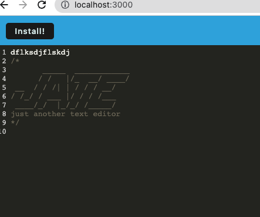

# progressive-web-app-text-editor

## Description
In this challenge we went through and added got the weppack to work by adding the rules for module. This challenge was different from others, in that the "TODO's"
were set out for us. I made changes to the database so it could be accessed by IndexedDB. I mainly used the searchbar to type in keywords surrounding the files with "TODO's" and found that in previous assignments there was generally code that worked well to get everything in working order.

## Usage
This app can be used to store text while offline. The text is automatically saved and put in the database for future use.

## Installation
After running npm i, npm run start, I have had the text editor working.
I have a screenshot of the working code above.

## Links
live link
https://immense-sands-64129.herokuapp.com/

git hub link
https://github.com/ClaytonSnell/progressive-web-app-text-editor